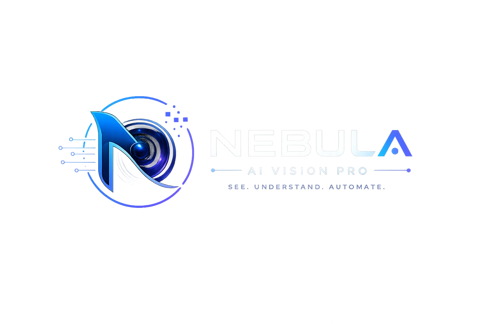
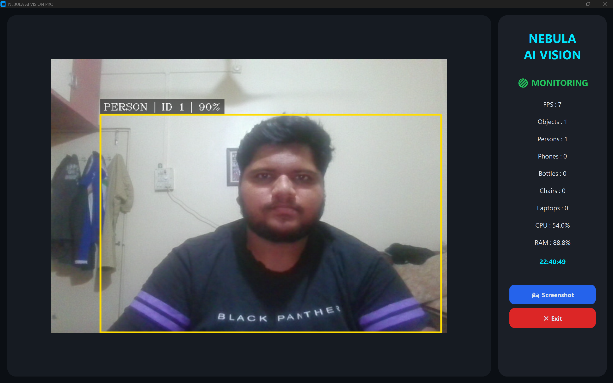
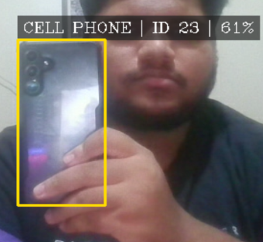
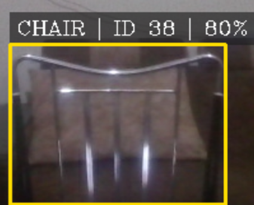
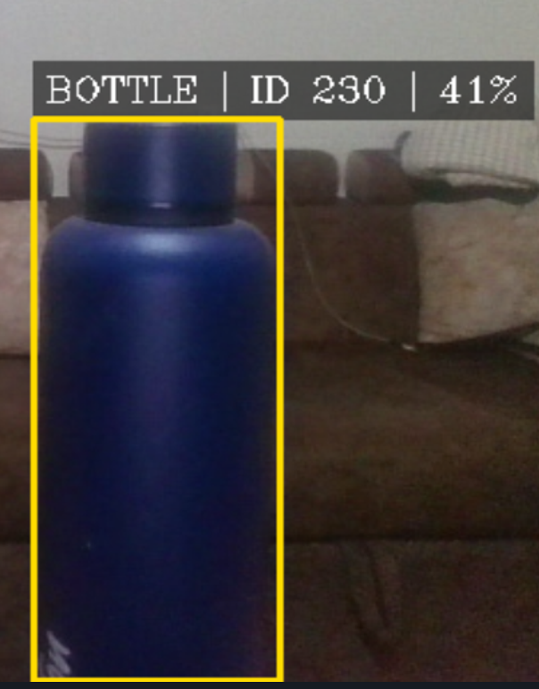
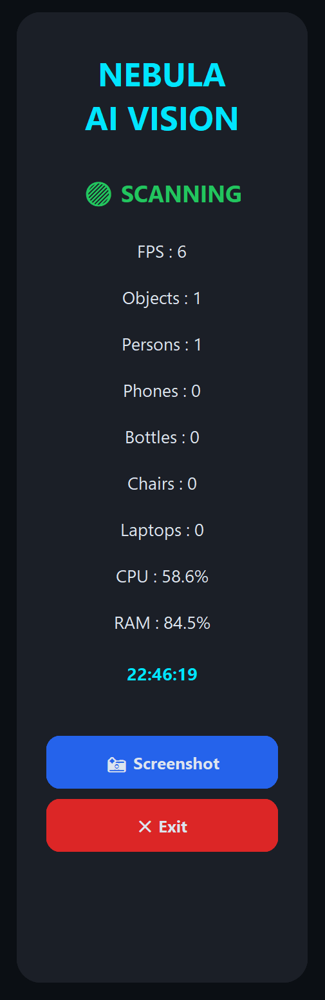

<p align="left">
  
</p>
<p align="left">
  <strong>Transforming Computer Vision into an Intelligent Real-Time Experience.</strong>
</p>

---

### Professional Real-Time Object Detection & Tracking System

Built with **Python • YOLOv8 • ByteTrack • OpenCV • CustomTkinter**

Detect • Track • Monitor • Analyze


</p>

---

# 📖 Overview

Nebula AI Vision Pro is a modern Artificial Intelligence powered computer vision application capable of detecting and tracking objects in real time using a webcam.

Unlike traditional object detection demos, Nebula AI Vision Pro combines an advanced AI detection engine with a premium fullscreen desktop interface that provides live analytics, system monitoring, and an intuitive user experience.

The application was developed as part of the **CodeAlpha Artificial Intelligence Internship** to demonstrate practical implementation of Deep Learning and Computer Vision.

---

# ✨ Features

## 🎯 AI Object Detection

- Real-Time Object Detection
- YOLOv8 Detection Engine
- High Accuracy Detection
- Confidence Score Display

---

## 🎯 Object Tracking

- ByteTrack Object Tracking
- Persistent Object IDs
- Multi-Object Tracking
- Live Tracking Updates

---

## 🖥 Professional User Interface

- Fullscreen Desktop Application
- Modern Dark Theme
- Professional Dashboard
- Responsive Layout
- Live Camera Feed

---

## 📊 Live Analytics Dashboard

- FPS Monitoring
- Object Counter
- Person Counter
- Phone Detection
- Bottle Detection
- Chair Detection
- Laptop Detection

---

## 💻 System Monitoring

- CPU Usage
- RAM Usage
- Live Digital Clock
- Detection Status Indicator

---

## 📸 Utility Features

- Screenshot Capture
- One Click Exit
- Real-Time Video Processing
- Smooth Detection Experience

---

# 🛠 Technologies Used

| Technology | Purpose |
|------------|---------|
| Python | Core Programming |
| YOLOv8 | Object Detection |
| ByteTrack | Object Tracking |
| OpenCV | Computer Vision |
| CustomTkinter | Professional GUI |
| Pillow | Image Processing |
| Psutil | CPU & RAM Monitoring |
| NumPy | Numerical Operations |

---

# 📂 Project Structure

```
Nebula-AI-Vision/

│

├── assets/

├── logs/

├── screenshots/

├── detector.py

├── ui.py

├── main.py

├── requirements.txt

├── README.md

└── yolov8n.pt
```

---

# 🖼 Application Preview

## 🏠 Main Interface



---

## 📱 Phone Detection
 


---

## 🪑 Chair Detection



---

## 🧴 Bottle Detection



---

## 📊 Live Analytics Dashboard



---

# ⚙ Installation

Clone the repository

```bash
git clone https://github.com/Parth-Kokitkar/CodeAlpha_Nebula-AI-Vision.git
```

Move into the project

```bash
cd Nebula-AI-Vision
```

Install dependencies

```bash
pip install -r requirements.txt
```

Run the application

```bash
python main.py
```

---

# 📦 Requirements

```
Python 3.10+

OpenCV

Ultralytics

CustomTkinter

Pillow

Psutil

NumPy
```

---

# 🚀 Future Improvements

- Face Recognition
- Emotion Detection
- Gesture Control
- Vehicle Detection
- Number Plate Recognition
- Fire Detection
- Weapon Detection
- Voice Assistant Integration
- AI Security Monitoring
- Cloud Database Integration

---

# 🎯 Project Highlights

✅ Modern Fullscreen Interface

✅ AI Powered Object Detection

✅ Object Tracking using ByteTrack

✅ Live System Monitoring

✅ Screenshot Capture

✅ Professional Dashboard

✅ Real-Time Analytics

---

# 📜 License

This project is developed for educational and internship purposes.

---

# 👨‍💻 Developer

**Parth Kokitkar**

B.Tech Student – Artificial Intelligence

MIT ADT University

Passionate about Artificial Intelligence, Computer Vision, and Intelligent Software Systems.

---

## 🌌 Nebula AI Vision Pro

**Transforming Computer Vision into an Intelligent Real-Time Experience.**

Built with **Python • YOLOv8 • OpenCV • ByteTrack • CustomTkinter**

© 2026 Parth Kokitkar